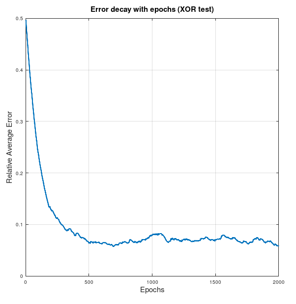
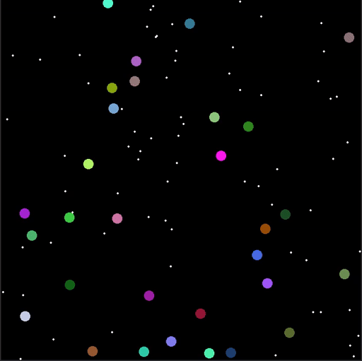
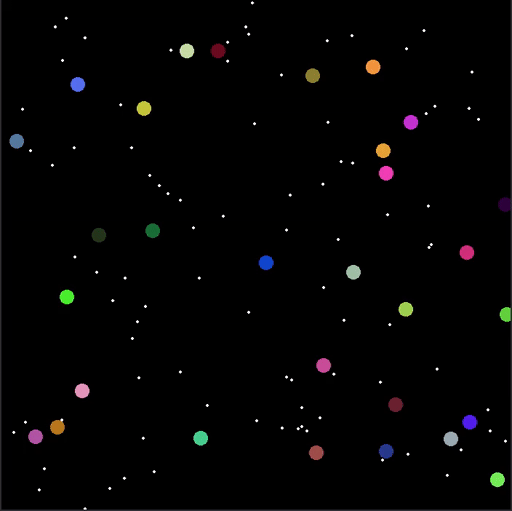

# NEAT in C++ from Scratch

Barebones neural network with modular setup for hidden layer and neuron configuration. 

Neural Network construction adapted from [Dave Miller's blog]( http://www.millermattson.com/dave/?p=54)

### Toggle the connection view to 3 nearest bodies by pressing `b`

### Toggle the connection view to 3 nearest pellets by pressing `p`

#### You can also view the connections to wall by pressing `w`

